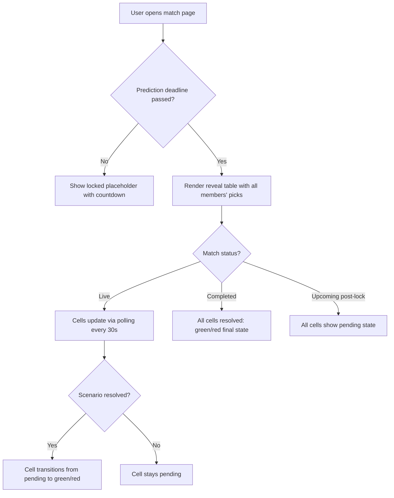

# UI/UX Specification: Prediction Reveal Table
**Designer**: UI/UX Agent
**Date**: 2026-03-29
**Status**: Draft

---

## 1. User Flow

### Primary Flow: Viewing the Reveal Table



### User Journey Context

The user arrives at the match page (`/group/[groupId]/match/[matchId]`) to check scores and rankings. They scroll past the Match Leaderboard to see the Prediction Reveal Table. The primary intent on this screen is comparison: "What did my friends pick, and who's getting it right?"

During a live match, the user revisits this page repeatedly. The reveal table rewards each visit with new green/red cells as scenarios resolve -- delivering the "bragging rights" dopamine hit that drives engagement.

---

## 2. Screen/View Inventory

| Screen / State | Purpose | Entry Point |
|---|---|---|
| **Pre-lock placeholder** | Communicate that predictions are private until lock time; build anticipation | Match page, before prediction deadline |
| **Post-lock reveal table (pending-heavy)** | Show everyone's picks; most cells pending | Match page, after lock but before/early in match |
| **Live match reveal table (mixed)** | Real-time updates as cells flip from pending to correct/incorrect | Match page during live match |
| **Post-match reveal table (all resolved)** | Final state, all cells green/red, complete comparison view | Match page after match completion |
| **Empty: no scenarios** | Graceful fallback when no scenarios exist for the match | Match page (edge case) |
| **Empty: solo member** | Single member in squad, table renders but with a nudge to invite friends | Match page (edge case) |

---

## 3. Component Specifications

### 3.1 `PredictionRevealSection` (Container)

- **Purpose**: Wrapper that handles visibility logic -- decides whether to render the table or the locked placeholder. This is the component added to the match page below `<MatchLeaderboard>`.
- **Existing Component to Extend/Use**: New -- because no existing component manages this visibility toggle. Follows the same server-component-with-client-child pattern as the match header (server component renders `LiveMatchScorecard` client child).
- **Props**:
  ```ts
  interface PredictionRevealSectionProps {
    groupId: string;
    matchId: number;
    currentUserId: string;
    matchStatus: MatchStatus;
    matchDate: string;
    matchTimeIst: string;
    predictionDeadline: string | null; // from match_group_settings
    isLocked: boolean;                 // from match_group_settings
  }
  ```
- **Behavior**:
  - Computes whether the lock condition is met using `computeDeadline()` from `lib/utils.ts` and the `matchStatus` / `isLocked` props.
  - If NOT locked: renders `RevealLockedPlaceholder`.
  - If locked AND scenarios exist: fetches data server-side, renders `PredictionRevealTable`.
  - If locked AND no scenarios: does not render (returns `null`).
- **States**:
  - **Pre-lock**: Renders `RevealLockedPlaceholder`.
  - **Post-lock**: Renders `PredictionRevealTable` (SSR with data).
  - **Error**: If data fetch fails, renders nothing (silent -- the leaderboard above already confirms the page works).

### 3.2 `RevealLockedPlaceholder`

- **Purpose**: Shown before the prediction deadline. Communicates that picks are private and builds anticipation for the reveal.
- **Existing Component to Extend/Use**: Follows the `EmptyState` component pattern from `components/shared/empty-state.tsx` but with a custom layout to include the countdown. Not a direct reuse because the EmptyState component does not support a countdown timer or the specific visual treatment needed here.
- **Props**:
  ```ts
  interface RevealLockedPlaceholderProps {
    deadline: Date;
  }
  ```
- **Visual Spec**:
  - Container: `rounded-[14px] border border-[var(--border-light)] bg-[var(--bg-card)] p-8 text-center` (matches the leaderboard empty state pattern).
  - Lock icon: `Lock` from `lucide-react`, `h-8 w-8 text-[var(--text-muted)]`, centered in a `h-16 w-16 rounded-full bg-[var(--bg-elevated)]` circle (matching `EmptyState` icon pattern).
  - Heading: `font-display text-base font-semibold text-[var(--text-primary)]` -- copy: "Picks Under Wraps" (Copywriter to finalize).
  - Subtext: `text-sm text-[var(--text-secondary)]` -- copy: "Everyone's predictions will be revealed when the match locks in."
  - Countdown: `font-stats text-sm text-[var(--cyan)]` showing time remaining using `formatCountdown()` from `lib/utils.ts`. Uses `useCountdown` hook or a simple `setInterval` for live countdown. Format: "Reveal in 2h 15m".
- **States**:
  - Default: Shows countdown.
  - Expired (deadline passed but page not re-rendered yet): Shows "Predictions revealed -- refresh to see picks" with a subtle prompt. This is a race condition edge case when the user stays on the page across the deadline boundary.
- **Responsive Behavior**: Same on all viewports. Centered content scales naturally.
- **Accessibility**: Lock icon has `aria-hidden="true"`. The countdown is wrapped in an `aria-live="polite"` region so screen readers announce updates.

### 3.3 `PredictionRevealTable` (Core Component)

- **Purpose**: The main matrix table showing all members' predictions across all scenarios, with color-coded cells.
- **Existing Component to Extend/Use**: New -- no existing table component exists in the codebase. The `MatchLeaderboard` uses a grid layout (not a semantic table), but per NFR-005 the reveal table MUST use semantic `<table>` elements for screen reader compatibility. The visual styling follows leaderboard patterns (bg-card, border-light, font-display headers).
- **Props**:
  ```ts
  interface PredictionRevealTableProps {
    members: { userId: string; displayName: string }[];
    scenarios: { id: string; title: string; systemCategory: string | null; points: number }[];
    predictions: Map<string, Map<string, { value: string; isCorrect: boolean | null }>>;
    // predictions keyed by `userId` -> `scenarioId` -> prediction data
    currentUserId: string;
    matchStatus: MatchStatus;
    matchId: number;
    groupId: string;
  }
  ```
- **Visual Spec** (detailed in Section 3.3.1 through 3.3.5 below).
- **States**:
  - **Default (post-lock, all pending)**: All prediction cells in pending state. Valid state when match just locked.
  - **Mixed (live match)**: Some cells pending, some resolved. Dynamic updates via polling.
  - **All resolved (post-match)**: Every cell is green or red. No pending cells. Final state.
  - **Loading (client-side polling refresh)**: No visible loading indicator -- cells retain last-known state during background poll (NFR: silent retry).
  - **Error (poll failure)**: No visible change. Last-known state persists.
  - **Empty rows**: A member with no predictions shows a dash in every cell. No color.

#### 3.3.1 Table Container

- Outer wrapper: `rounded-[14px] border border-[var(--border-light)] bg-[var(--bg-card)] overflow-hidden` (matches `MatchLeaderboard` container exactly).
- The table is wrapped in a scrollable div for horizontal overflow: `overflow-x-auto`.
- Section heading (outside the card, above it):
  ```
  <h2 class="font-display text-lg font-semibold text-[var(--text-primary)]">
    Everyone's Picks
  </h2>
  ```
  Matches the "Match Leaderboard" heading style. Wrapped in a `space-y-4` container (heading + card), consistent with the leaderboard section structure.

#### 3.3.2 Table Header Row

- Uses `<thead>` with a single `<tr>`.
- **First column header (Member)**: Sticky left. Text: "PLAYER" (matches leaderboard column header copy). Styled: `text-[10px] font-display font-semibold uppercase tracking-wider text-[var(--text-muted)]`.
- **Scenario column headers**: Each header shows the scenario title, truncated with ellipsis if needed.
  - **Mobile (< 640px)**: Use short labels derived from `system_category` via an abbreviation map (see Section 3.3.6). Max width per column: `64px`. Full title available on tap via a tooltip (see Section 4).
  - **Tablet (640px - 1023px)**: Abbreviated labels, slightly wider columns: `80px`.
  - **Desktop (>= 1024px)**: Full scenario titles where space permits. Min column width: `80px`, max: `120px`. Truncate with ellipsis and title attribute for native tooltip.
- Header row background: `bg-[var(--bg-elevated)]` to differentiate from body rows.
- Bottom border: `border-b border-[var(--border-light)]` (matches leaderboard header).
- **Points badge**: Below each scenario title, a small points indicator: `font-stats text-[9px] text-[var(--text-muted)]` showing e.g. "10 pts". This helps users understand stakes at a glance.

#### 3.3.3 Table Body Rows (Members)

- Each `<tr>` corresponds to one approved group member.
- **Row ordering**: Follows the leaderboard ranking order (by points descending, earliest submission). Members not in the leaderboard (zero predictions) are appended at the end, sorted alphabetically by display name.
- **Current user row highlight**: Matches the leaderboard pattern exactly:
  - Background: `bg-[var(--cyan-soft)]`
  - Left border accent: `border-l-2 border-l-[var(--cyan)]`
  - "(you)" suffix after the display name: `text-xs text-[var(--text-muted)]`
- **Other rows**:
  - Background: transparent (inherits card bg).
  - Hover: `hover:bg-[var(--bg-hover)]` for desktop pointer interaction.
  - Left border: `border-l-2 border-l-transparent` (reserves space, prevents layout shift on highlight).
- **First column (Member name)**:
  - Sticky on mobile: `sticky left-0 z-10` with a background color matching the row's background (to prevent content bleeding through during horizontal scroll).
  - Text: `text-sm font-medium text-[var(--text-primary)] truncate`. Max width: `120px` on mobile, `160px` on desktop.
  - A subtle right-edge shadow on the sticky column when scrolled: applied via a CSS pseudo-element or a gradient overlay on the scroll container (see Section 3.3.5).

#### 3.3.4 Prediction Cells

Each `<td>` represents one member's prediction for one scenario. This is the heart of the feature.

**Cell Content**:
- The member's prediction value (text), truncated with ellipsis if too long.
- Font: `font-stats text-[11px]` for the prediction value.
- Max cell width: determined by column sizing (64px mobile, 80px tablet, 80-120px desktop).
- Padding: `px-2 py-2.5` for comfortable touch targets on mobile.

**Cell Color-Coding**:

| State | Background | Text Color | Icon | CSS |
|---|---|---|---|---|
| **Correct** | `color-mix(in srgb, var(--success) 12%, transparent)` | `var(--success)` | `Check` (lucide), `h-3 w-3` | Low-opacity green tint |
| **Incorrect** | `color-mix(in srgb, var(--danger) 12%, transparent)` | `var(--danger)` | `X` (lucide), `h-3 w-3` | Low-opacity red tint |
| **Pending** | `color-mix(in srgb, var(--pending) 8%, transparent)` | `var(--text-secondary)` | None (or `Clock` if space permits on desktop) | Muted slate tint; subtle, not distracting |
| **No pick** | `transparent` | `var(--text-muted)` | None | Dash character: "---" |

**Design decision on pending color**: Use `var(--pending)` (slate gray `#64748B`) at 8% opacity, NOT bright yellow. Rationale:
1. At match start, 100% of cells are pending. A table of 15x16=240 bright yellow cells creates overwhelming visual noise.
2. The purpose of color-coding is to make correct (green) and incorrect (red) cells pop. Pending cells should recede.
3. As the match progresses, resolved cells (green/red) naturally emerge from the calm pending background -- this creates a satisfying "reveal" effect.
4. The existing `PredictionStatusPill` already uses `var(--pending)` for unresolved picks ("In Play"), so this is consistent with the design system.

**Accessibility indicator** (NFR-006): Each resolved cell includes a small icon (Check or X) in addition to the color. This serves color-blind users. The icon is placed inline before the prediction value:
```
[check] CSK    (green bg)
[x] MI         (red bg)
190+           (pending, no icon)
---            (no pick, no icon)
```

On mobile where space is tight, the icon alone may suffice -- the prediction value can be accessed via tap-to-expand (P2) or tooltip. For v1, both icon and truncated value are shown.

#### 3.3.5 Horizontal Scroll & Sticky Column

**Scroll container structure**:
```
<div class="relative">
  <!-- Scroll shadow overlay (right edge) -->
  <div class="scroll-shadow-right" />

  <div class="overflow-x-auto">
    <table class="w-full min-w-[...calculated...]">
      ...
    </table>
  </div>
</div>
```

**Sticky first column**:
- Applied to the `<th>` and all `<td>` in the first column: `sticky left-0 z-10`.
- Background must match the row background to prevent content overlap during scroll:
  - Header row: `bg-[var(--bg-elevated)]`
  - Current user row: `bg-[var(--cyan-soft)]` (needs an explicit bg since `--cyan-soft` is 15% opacity on card bg -- use `bg-[var(--bg-card)]` as base with cyan overlay)
  - Other rows: `bg-[var(--bg-card)]`
  - Hover rows: handled with a group-hover pattern or JavaScript

**Scroll indicator**: A gradient shadow on the right edge of the sticky column, visible only when the table is scrolled:
- CSS: `box-shadow: 4px 0 8px -2px rgba(0,0,0,0.3)` on the sticky column when scroll position > 0.
- Alternatively, use a static subtle shadow: `box-shadow: 2px 0 4px -1px rgba(0,0,0,0.15)` always visible on the sticky column's right edge. This is simpler and still signals scroll affordance.

**Right-edge scroll hint**: On initial load (before user has scrolled), a subtle gradient fade on the right edge of the scroll container signals that more content is available: `bg-gradient-to-l from-[var(--bg-card)] to-transparent`, absolutely positioned, `w-8 h-full pointer-events-none`.

**Minimum table width calculation**:
- First column: `120px` (mobile) / `160px` (desktop)
- Each scenario column: `64px` (mobile) / `80px` (tablet) / `100px` (desktop)
- With 16 scenarios: `120 + 16*64 = 1144px` mobile min-width (scrollable)
- With 8 scenarios on desktop: `160 + 8*100 = 960px` (fits in most viewports)

#### 3.3.6 Scenario Title Abbreviation Map

For mobile column headers, use abbreviated labels derived from `system_category`. Custom scenarios use their first 3-4 characters + ellipsis.

| `system_category` | Short Label | Full Title (tooltip) |
|---|---|---|
| `match_winner` | MW | Who's winning this? |
| `toss_winner` | TW | Who calls the toss? |
| `top_scorer` | TS | Who tops the run chart? |
| `top_wicket_taker` | TWk | Who's the top wicket-taker? |
| `player_of_match` | PoM | Who takes the award? |
| `first_innings_score` | 1st | First innings total? |
| `total_match_runs` | Runs | How many runs in the match? |
| `powerplay_score` | PP | Powerplay total (first 6)? |
| `powerplay_wickets` | PPW | Wickets in the powerplay? |
| `total_sixes` | 6s | How many sixes fly out? |
| `total_wickets` | Wkts | Total wickets in the match? |
| `batsman_fifty` | 50? | Anyone hitting a fifty? |
| `bowler_three_wkt` | 3W? | Any bowler grabbing 3+ wickets? |
| `had_super_over` | SO? | Super Over on the cards? |
| `most_sixes` | M6 | Who's the six-hitting machine? |
| `first_wicket_over` | FWO | When does the first wicket fall? |
| (custom) | First 3 chars... | Full custom title |

This abbreviation map should live in `lib/constants.ts` alongside `SYSTEM_SCENARIOS` for single-source-of-truth maintenance.

### 3.4 `RevealColorLegend`

- **Purpose**: Compact legend explaining the color-coding system. First-time visitors need this; repeat visitors ignore it.
- **Existing Component to Extend/Use**: New -- no legend component exists. Minimal footprint.
- **Visual Spec**:
  - Positioned directly below the table, inside the card but after `</table>`.
  - Layout: horizontal flex row with 3-4 items, centered. `flex items-center justify-center gap-4 py-3 border-t border-[var(--border-light)]`.
  - Each item: a small colored square (8x8px, `rounded-[2px]`) + label in `text-[10px] font-display uppercase tracking-wider text-[var(--text-muted)]`.
  - Items:
    - Green square + "Correct"
    - Red square + "Missed"
    - Gray square + "In Play"
    - Dash + "No Pick"
  - The squares use the same `color-mix` background formula as the cells for visual consistency.
- **Responsive**: On very narrow screens (< 360px), wraps to two lines. Otherwise single line.
- **Accessibility**: `role="note"` on the legend container. Each color swatch has `aria-hidden="true"` since the label provides the meaning.

### 3.5 `RevealTablePollingWrapper` (Client Component)

- **Purpose**: Client component that wraps the table and handles polling for live prediction resolution updates.
- **Existing Component to Extend/Use**: Follows the `LiveMatchScorecard` + `useMatchPolling` pattern. The scorecard is a client component that takes SSR initial data and polls for updates.
- **Props**:
  ```ts
  interface RevealTablePollingWrapperProps {
    // SSR initial data (passed from server component)
    initialPredictions: Map<string, Map<string, { value: string; isCorrect: boolean | null }>>;
    members: { userId: string; displayName: string }[];
    scenarios: { id: string; title: string; systemCategory: string | null; points: number }[];
    currentUserId: string;
    matchStatus: MatchStatus;
    matchId: number;
    groupId: string;
  }
  ```
- **Behavior**:
  - If `matchStatus === 'live'`: Polls predictions every 30 seconds (matching existing poll cadence). Uses a custom `usePredictionPolling` hook (modeled on `useMatchPolling`).
  - If `matchStatus === 'completed' | 'abandoned' | 'no_result'`: No polling. Data is final.
  - If `matchStatus === 'upcoming'` (post-lock but pre-live): No polling. Data won't change.
  - On poll response: merges updated `is_correct` values into the prediction map. Only fetches prediction resolution status changes, not the full table (NFR-002).
  - Page Visibility API: pauses polling when tab is hidden, resumes + immediate fetch when visible (matching `useMatchPolling` pattern).
- **States**:
  - Active polling: No visible indicator (silent background updates). Cells update in-place.
  - Poll error: Silent retry on next interval. No toast or error UI.

---

## 4. Interaction Details

### 4.1 Scenario Header Tooltip (Mobile)

- On mobile, tapping a column header shows the full scenario title in a lightweight tooltip.
- Implementation: Use the native `title` attribute on desktop (hover tooltip). On mobile, use a small popover triggered by tap, positioned below the header. Dismiss on tap-outside or scroll.
- The tooltip also shows the point value: "Who's winning this? (10 pts)".
- This avoids the need for a dedicated tooltip component -- use CSS `:hover` for desktop and a minimal JS toggle for mobile.

### 4.2 Cell Value Tooltip (Desktop Hover / Mobile Tap)

- When a prediction value is truncated (e.g., a long player name), hovering on desktop or tapping on mobile shows the full value.
- Desktop: `title` attribute on the `<td>` containing the full prediction value.
- Mobile: Same tap-popover pattern as headers, or defer to P2 "tap-to-expand cell details".
- For v1: rely on `title` attribute for desktop; on mobile, accept that very long values are truncated. The value is still readable in the context of the scenario (e.g., "V. Koh..." is understandable for "Virat Kohli" in a "Top Scorer" column).

### 4.3 Cell State Transitions

- When a cell transitions from pending to correct/incorrect (during live polling), apply a subtle transition:
  - `transition: background-color 0.5s ease` on all `<td>` elements.
  - This creates a smooth color fade rather than a jarring instant change.
  - No flip animation or shimmer for v1 (deferred to v2).
- The transition is CSS-only, no JavaScript animation library needed.

### 4.4 Scroll Behavior

- On mobile, the table scroll container has `-webkit-overflow-scrolling: touch` for momentum scrolling (default in modern browsers).
- The sticky first column creates a natural "anchor" so users always know which row they're looking at.
- No snap-scrolling -- free horizontal scroll is more natural for tables.

### 4.5 Loading Pattern

- **Initial load (SSR)**: No loading state. The table is server-rendered and appears as part of the page HTML. This matches the leaderboard pattern.
- **Live polling updates**: No skeleton or spinner. Cells retain their current state during poll. Updates apply in-place when data arrives.
- **If SSR data fetch fails**: The section does not render. No error state shown to the user (the leaderboard above confirms the page is working).

### 4.6 Error Handling UX

| Error Scenario | User Experience |
|---|---|
| SSR data fetch fails | Section not rendered. No error message. |
| Client poll fails (network) | Silent retry on next interval. Last-known state preserved. |
| User not a group member | RLS returns empty data. Table has no rows. Edge case caught by layout auth guard. |
| Zero scenarios | Section not rendered (`null`). No empty state for the table itself. |

---

## 5. Design Tokens Used

### Colors (from `globals.css`)

| Token | Value | Usage |
|---|---|---|
| `--success` | `#34D399` | Correct prediction cell bg tint + text |
| `--danger` | `#F87171` | Incorrect prediction cell bg tint + text |
| `--pending` | `#64748B` | Pending prediction cell bg tint (muted) |
| `--text-primary` | `#ecedf6` | Member names, prediction values |
| `--text-secondary` | `#9ba1b5` | Pending cell text, subtext |
| `--text-muted` | `#4a5068` | Column headers, "No pick" text, "(you)" suffix |
| `--bg-card` | `#171c28` | Table container background |
| `--bg-elevated` | `#252b3d` | Header row background, skeleton pulse |
| `--bg-hover` | `#2e3550` | Row hover state |
| `--cyan` | `#f3ffca` | Countdown text, current user accent |
| `--cyan-soft` | `#f3ffca15` | Current user row background |
| `--border-light` | `transparent` | Card border, header/row dividers |
| `--ghost-border` | `#9ba1b526` | N/A for this feature (no ghost focus needed) |

### Typography

| Token / Class | Usage |
|---|---|
| `font-display` (Space Grotesk) | Section heading, column headers |
| `font-stats` (Lexend) | Prediction values, points, countdown |
| `font-sans` (Manrope) | Member names, body text |

### Spacing & Sizing

| Pattern | Value | Source |
|---|---|---|
| Card border radius | `rounded-[14px]` | `MatchLeaderboard` container |
| Section spacing | `space-y-4` (heading to card) | `MatchLeaderboard` pattern |
| Page-level spacing | `space-y-6` | Match page layout |
| Cell padding | `px-2 py-2.5` | Comfortable touch target |
| Header text size | `text-[10px] uppercase tracking-wider` | Leaderboard header pattern |

### Component Patterns Reused

| Pattern | Source Component | Reuse |
|---|---|---|
| Card container | `MatchLeaderboard` | `rounded-[14px] border border-[var(--border-light)] bg-[var(--bg-card)] overflow-hidden` |
| Section heading | `MatchLeaderboard` | `font-display text-lg font-semibold text-[var(--text-primary)]` |
| Current user highlight | `MatchLeaderboard` | `bg-[var(--cyan-soft)] border-l-2 border-l-[var(--cyan)]` + "(you)" suffix |
| Status color mapping | `PredictionStatusPill` | `color-mix(in srgb, <color> <opacity>%, transparent)` formula |
| Empty/locked state | `EmptyState` | Icon-in-circle + heading + subtext centered layout |
| Polling pattern | `useMatchPolling` + `LiveMatchScorecard` | SSR initial data + client polling wrapper |
| Truncation | `ScenarioCard`, `MatchLeaderboard` | `truncate` utility class |

---

## 6. New Tokens/Components Introduced

### New CSS (Minimal)

No new CSS custom properties needed. All colors come from existing tokens.

One new utility may be helpful for the sticky column shadow, but it can be done inline:

```css
/* Sticky column right-edge shadow -- applied inline or as a utility */
.sticky-shadow {
  box-shadow: 2px 0 4px -1px rgba(0, 0, 0, 0.15);
}
```

**Justification**: The existing design system has no table-specific utilities because no other component uses semantic tables. This single shadow utility is the only addition needed.

### New Components

| Component | Justification |
|---|---|
| `PredictionRevealSection` | New visibility-gating container. No existing component handles the "show-after-lock" conditional rendering pattern for a table section. |
| `RevealLockedPlaceholder` | New locked state UI. While `EmptyState` is similar, the countdown timer and specific copy require a dedicated component. Could be refactored into an `EmptyState` variant later. |
| `PredictionRevealTable` | New. No existing table component. The leaderboard uses a grid, but the reveal table needs a semantic `<table>` for accessibility (NFR-005) and the matrix layout. |
| `RevealColorLegend` | New. No legend component exists. Tiny component (< 20 lines). |
| `RevealTablePollingWrapper` | New client component for polling. Follows the `LiveMatchScorecard` pattern but polls predictions instead of match scores. |
| `usePredictionPolling` | New hook. Modeled exactly on `useMatchPolling` but queries the predictions table. |

### New Type

```ts
// In types/index.ts
interface RevealTablePrediction {
  value: string;
  isCorrect: boolean | null;
}

interface RevealTableData {
  members: { userId: string; displayName: string }[];
  scenarios: { id: string; title: string; systemCategory: string | null; points: number }[];
  predictions: Record<string, Record<string, RevealTablePrediction>>;
  // predictions[userId][scenarioId] = { value, isCorrect }
}
```

### New Constant

```ts
// In lib/constants.ts
export const SCENARIO_ABBREVIATIONS: Record<string, string> = {
  match_winner: "MW",
  toss_winner: "TW",
  top_scorer: "TS",
  top_wicket_taker: "TWk",
  player_of_match: "PoM",
  first_innings_score: "1st",
  total_match_runs: "Runs",
  powerplay_score: "PP",
  powerplay_wickets: "PPW",
  total_sixes: "6s",
  total_wickets: "Wkts",
  batsman_fifty: "50?",
  bowler_three_wkt: "3W?",
  had_super_over: "SO?",
  most_sixes: "M6",
  first_wicket_over: "FWO",
};
```

---

## 7. Responsive Behavior Summary

### Mobile (< 640px)

```
┌──────────────────────────────────┐
│ Everyone's Picks                 │
├──────────────────────────────────┤
│ ┌────────┬────┬────┬────┬─ ─ ─  │
│ │ PLAYER │ MW │ TW │ TS │ ...→  │
│ │        │5pts│5pts│15pt│       │
│ ├────────┼────┼────┼────┼─ ─ ─  │
│ │ You*   │CSK │CSK │V.K │       │
│ │ ~~~~~~ │ ✓  │ ✗  │... │       │
│ ├────────┼────┼────┼────┤       │
│ │ Alice  │ MI │CSK │R.P │       │
│ │        │ ✗  │ ✗  │... │       │
│ └────────┴────┴────┴────┴─ ─ ─  │
│  ● Correct  ● Missed  ● In Play│
└──────────────────────────────────┘
  * = highlighted row with cyan accent
  → = horizontal scroll affordance
```

- First column sticky with shadow.
- Abbreviated column headers (MW, TW, TS, etc.).
- Column width: `64px`.
- Horizontal scroll with momentum.
- Right-edge gradient fade hints at more columns.
- Legend below table, inside card.

### Tablet (640px - 1023px)

- Same as mobile but wider columns: `80px`.
- Abbreviated headers still used.
- More columns visible without scrolling (approximately 6-7 with the wider viewport).
- First column width: `140px`.

### Desktop (>= 1024px)

```
┌─────────────────────────────────────────────────────────────────┐
│ Everyone's Picks                                                │
├─────────────────────────────────────────────────────────────────┤
│ ┌───────────┬──────────┬──────────┬──────────┬──────────┬─ ─ ─ │
│ │  PLAYER   │ Match    │ Toss     │ Top      │ Top Wkt  │      │
│ │           │ Winner   │ Winner   │ Scorer   │ Taker    │ ...→ │
│ │           │ 10 pts   │ 5 pts    │ 15 pts   │ 15 pts   │      │
│ ├───────────┼──────────┼──────────┼──────────┼──────────┤      │
│ │ You (you) │ ✓ CSK    │ ✗ MI     │ V. Kohli │ J. Bum.. │      │
│ │ ~~~~~~~~~─┤~~~~~~~~~~│~~~~~~~~~~│~~~~~~~~~~│~~~~~~~~~~│      │
│ │ Alice     │ ✗ MI     │ ✓ CSK    │ R. Pant  │ ---      │      │
│ │ Bob       │ ✓ CSK    │ ✓ CSK    │ ---      │ J. Bum.. │      │
│ └───────────┴──────────┴──────────┴──────────┴──────────┴─ ─ ─ │
│         ● Correct    ● Missed    ● In Play    --- No Pick      │
└─────────────────────────────────────────────────────────────────┘
```

- Full or near-full scenario titles in headers (truncate with ellipsis if needed).
- Column width: `80-120px` flexible.
- First column width: `160px`.
- With 8 or fewer scenarios: no horizontal scroll needed.
- With 16 scenarios: horizontal scroll activates, sticky first column.
- Row hover state for desktop pointer interaction.

---

## 8. Accessibility Checklist

| Requirement | Implementation |
|---|---|
| **Semantic HTML** (NFR-005) | Use `<table>`, `<thead>`, `<tbody>`, `<th scope="col">`, `<th scope="row">`, `<td>`. No div-table. |
| **Color-blind safe** (NFR-006) | Every resolved cell includes a Check or X icon alongside color. "No pick" uses text dash, not color alone. |
| **Color contrast** | Green `#34D399` on `#171c28` bg: 7.2:1 ratio (passes AAA). Red `#F87171` on `#171c28`: 5.8:1 (passes AA). Pending `#9ba1b5` on `#171c28`: 5.1:1 (passes AA). |
| **Keyboard navigation** | Table cells are not interactive (no buttons inside), so standard tab order suffices. The scroll container should be focusable with `tabindex="0"` and `role="region"` + `aria-label="Prediction comparison table"` so keyboard users can scroll it. |
| **Screen reader** | `<caption>` element on the table: "Predictions by all squad members for this match". Column headers use `<th scope="col">`. Row headers (member names) use `<th scope="row">`. |
| **Reduced motion** | The `transition: background-color 0.5s ease` on cells respects `prefers-reduced-motion: reduce` -- disable transition for users who prefer reduced motion. |
| **Scroll region** | Horizontal scroll container has `role="region"`, `aria-label="Scroll to see more scenario columns"`, and `tabindex="0"`. |
| **Locked placeholder** | Countdown uses `aria-live="polite"` for screen reader updates. Lock icon has `aria-hidden="true"`. |

---

## 9. Edge Case Visuals

| Edge Case | Visual Treatment |
|---|---|
| **1 member (solo)** | Table renders with single row. Below the table (inside card), a subtle CTA: "Predictions are better with friends. Share your squad invite." with a link to the invite flow. Uses `text-sm text-[var(--text-secondary)]` + cyan-accented link. |
| **0 scenarios** | Section does not render. No empty state needed -- the leaderboard or prediction page would already communicate this. |
| **All pending (match just started)** | Valid state. The table is a calm field of muted gray cells with prediction values visible. The legend clarifies the "In Play" state. |
| **Member with 0 predictions** | All cells show "---" with no color background. The row is still present (they're an approved member). |
| **Very long prediction value** | Truncated with ellipsis. Full value available via `title` attribute (desktop hover). Example: "Virat Kohli" becomes "V. Koh..." in a 64px-wide mobile cell. |
| **Match abandoned** | Table shows whatever state was last resolved. Unresolved cells stay pending. No special treatment beyond what RLS provides. If the PM adds a note about abandonment, it would go above the table, not inside it. |

---

## 10. Open Questions Resolved

### Pending color: Yellow vs. Muted Gray

**Decision: Muted gray (`var(--pending)` at 8% opacity).**

Rationale:
- With 16 scenario columns, a table full of bright yellow cells at match start is visually overwhelming and creates "alert fatigue" -- users subconsciously treat yellow as a warning.
- The design system already assigns `var(--pending)` = `#64748B` (slate gray) for the "In Play" status in `PredictionStatusPill`. Using the same token maintains consistency.
- Green and red cells have maximum visual impact when they emerge from a calm neutral background, creating the "reveal" moment that drives the feature's engagement loop.
- If user testing reveals the table looks too "flat" with gray, we can bump the pending opacity from 8% to 12% or add a subtle dotted border to pending cells. This is a CSS-only change.

### Scenario title display on mobile

**Decision: Abbreviated codes (MW, TW, TS, etc.) with tap-to-reveal full title.**

Rationale:
- Rotated text is hard to read and breaks the horizontal scan pattern. Users read tables left-to-right; vertical text forces neck/eye rotation.
- Scrollable full titles would make columns too wide, showing only 2-3 columns on a mobile viewport and requiring excessive scrolling.
- Abbreviated codes are compact (2-4 characters), learnable (users quickly memorize MW = Match Winner after 2-3 matches), and cricket fans are already familiar with abbreviations like PoM, PP, etc.
- The full title is always one tap away for new users.

### Table heading copy

**Recommendation for Copywriter**: "Everyone's Picks" -- it is clear, casual, and matches the Bragg brand voice (not corporate, not overly playful). Alternatives: "The Reveal" (dramatic but less descriptive), "Prediction Breakdown" (descriptive but corporate). The Copywriter agent has the final call.

---

## 11. Component Hierarchy Diagram

```
MatchLeaderboardPage (server component, existing)
├── ... (back link, match header, scorecard, leaderboard)
│
└── PredictionRevealSection (server component, NEW)
    │
    ├── [if pre-lock] RevealLockedPlaceholder (client component, NEW)
    │   └── useCountdown (or simple setInterval)
    │
    └── [if post-lock] RevealTablePollingWrapper (client component, NEW)
        │   └── usePredictionPolling (hook, NEW)
        │
        ├── PredictionRevealTable (presentational, NEW)
        │   ├── <table>
        │   │   ├── <thead> (scenario column headers with abbreviations)
        │   │   └── <tbody> (member rows with color-coded cells)
        │   │       └── Cell: icon + prediction value + bg color
        │   │
        │   └── RevealColorLegend (presentational, NEW)
        │
        └── [if 1 member] Solo squad CTA
```

---

## 12. Design System Compliance Notes

1. **No new colors**: All colors come from existing `globals.css` tokens. The `color-mix()` formula is already established by `PredictionStatusPill`.
2. **No new fonts**: Uses `font-display`, `font-stats`, and `font-sans` -- all existing.
3. **No borders (tonal layering)**: Consistent with the "Stadium Kinetic" philosophy. The table uses `--border-light` (transparent) for subtle structure and tonal backgrounds (`--bg-elevated` for headers) rather than visible lines.
4. **Dark-only**: No light mode considerations needed. The design system is dark-only.
5. **Card pattern**: The table container exactly matches the leaderboard card pattern (`rounded-[14px]`, `bg-card`, `border-light`).
6. **Existing hover/highlight patterns**: Current user row highlight and row hover states directly reuse leaderboard patterns.
