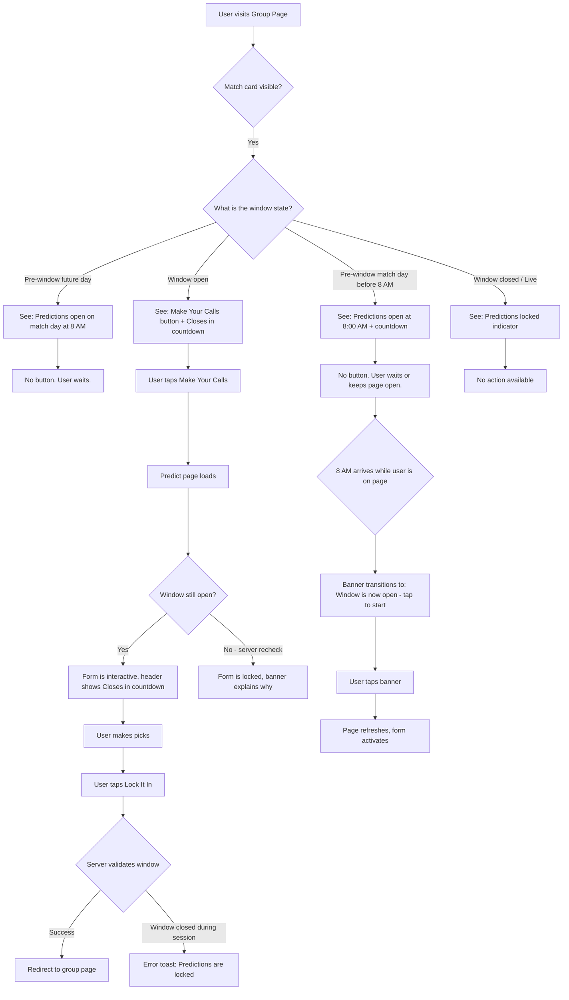
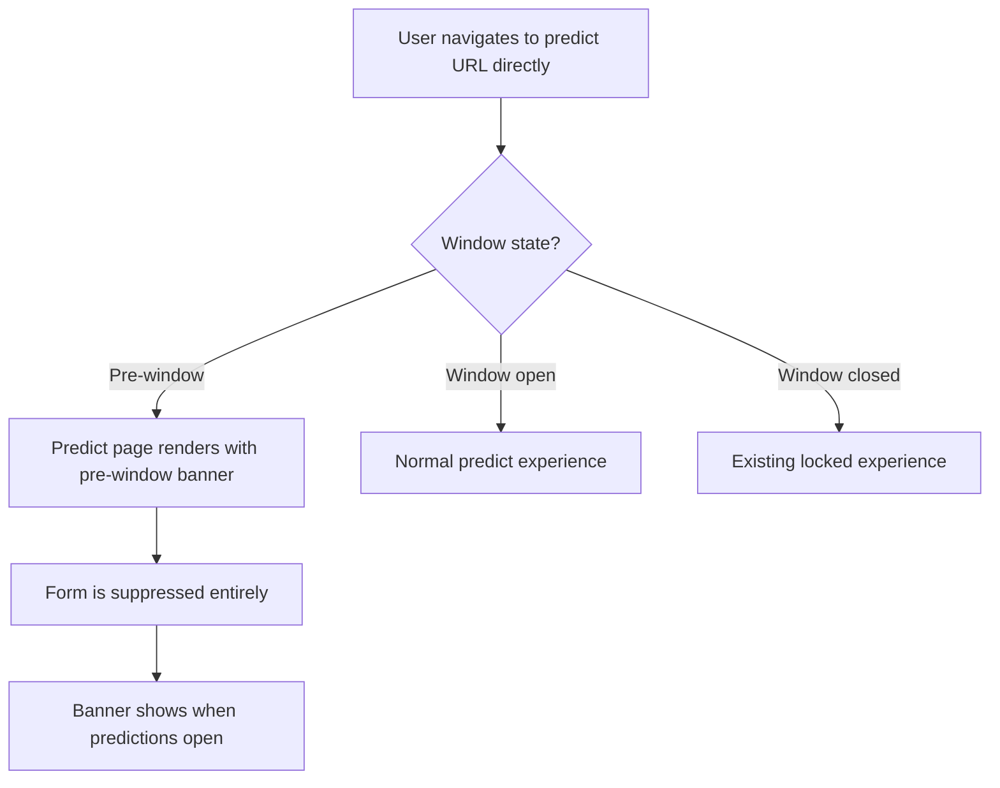
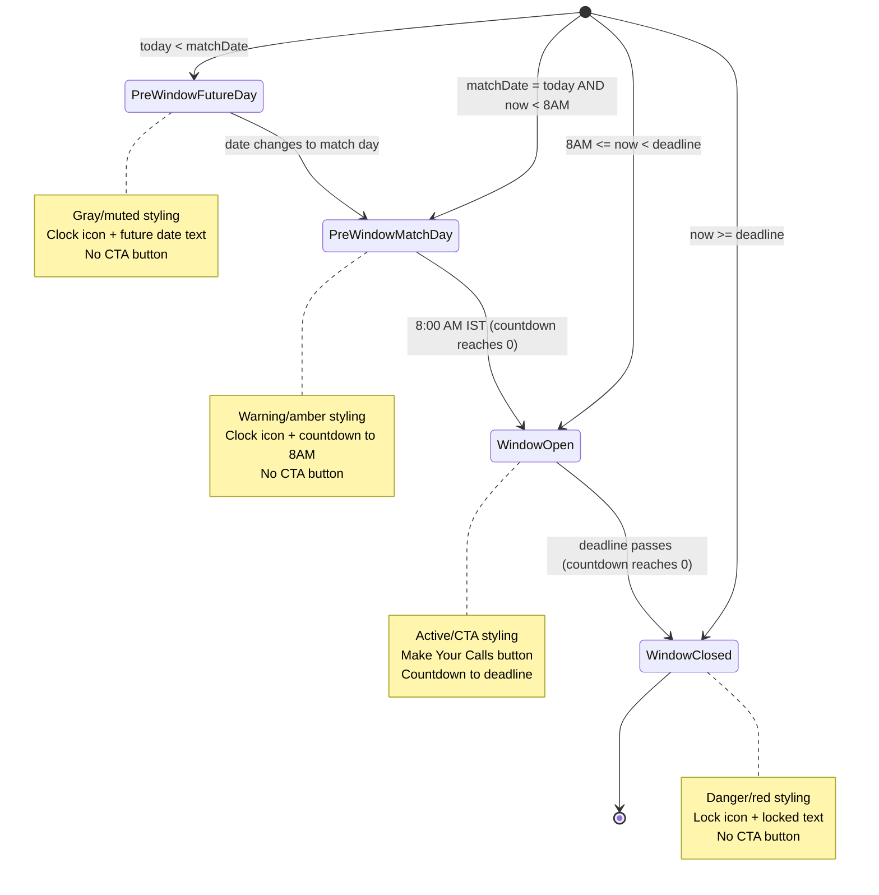

# UI/UX Specification: Prediction Window
**Designer**: UI/UX Agent
**Date**: 2026-03-29
**Status**: Draft

---

## 1. User Flow

### 1.1 Primary Flow: Group Page to Prediction Submission



### 1.2 Edge Flow: Direct URL Access Before Window



---

## 2. Screen/View Inventory

| Screen | Purpose | Entry Point | Changes Required |
|---|---|---|---|
| **Group Page** (`/group/[groupId]`) | Lists upcoming matches with window status indicators | Dashboard / direct link | Replace CTA button area with 4-state window indicator |
| **Predict Page** (`/group/[groupId]/predict/[matchId]`) | Prediction form with window-aware header and gating | Group page CTA / direct URL | Add pre-window state, countdown in header, form suppression |

No new screens are introduced. Both changes are modifications to existing views.

---

## 3. Component Specifications

### 3.1 WindowStatusIndicator (Match Card)

- **Purpose**: Replaces the "Make Your Calls" / "Predict Early" button area on each match card with a 4-state window indicator.
- **Existing Component to Extend/Use**: Inline in `group/[groupId]/page.tsx` -- currently a `<Link>` element. This becomes a new client component `WindowStatusIndicator` because it needs `useCountdown` for live updates.
- **Location**: `components/prediction/window-status-indicator.tsx`
- **Why a new component**: The group page is a server component. The window status needs client-side countdown timers and real-time state transitions. Extracting it as a client island keeps the group page server-rendered while enabling live updates in this specific area. The existing pattern of `<LiveMatchCard>` (client component embedded in server page) is the precedent.

#### Props

```typescript
interface WindowStatusIndicatorProps {
  matchId: number;
  matchDate: string;        // e.g., "2026-04-01"
  matchTimeIst: string;     // e.g., "19:30:00"
  groupId: string;
  customDeadline?: string | null;
  windowOpen: Date;         // Precomputed: 8 AM IST on matchDate
  windowClose: Date;        // Precomputed: computeDeadline() result
}
```

#### States

| State | Condition | Visual |
|---|---|---|
| **Pre-window (future day)** | `today < matchDate` | Informational text only. No button. Gray/muted styling. |
| **Pre-window (match day)** | `matchDate === today && now < 8 AM IST` | Informational text + countdown to 8 AM. No button. Pending/amber styling. |
| **Window open** | `8 AM IST <= now < deadline` | CTA button "Make Your Calls" + countdown to deadline. Active/success styling. |
| **Window closed** | `now >= deadline` | Locked text indicator. Danger/red styling. |

#### Visual Specification Per State

**State 1: Pre-window (future day)**
```
[Clock icon] Predictions open {matchDate} at 8:00 AM IST
```
- Icon: `Clock` from lucide-react, `h-4 w-4`, color `var(--text-muted)`
- Text: `font-display text-xs`, color `var(--text-muted)`
- No button rendered
- Full width on mobile, right-aligned on `sm:` breakpoint (matches current CTA placement)

**State 2: Pre-window (match day, before 8 AM)**
```
[Clock icon] Predictions open at 8:00 AM IST
             Opens in {countdown}
```
- Icon: `Clock` from lucide-react, `h-4 w-4`, color `var(--warning)`
- First line: `font-display text-xs`, color `var(--text-secondary)`
- Countdown line: `font-stats text-xs`, color `var(--warning)`, `aria-live="polite"`
- Container: `rounded-xl px-4 py-2.5 bg-[color-mix(in_srgb,var(--warning)_8%,transparent)]` (follows `PredictionStatusPill` tinted-bg pattern)
- No button rendered

**State 3: Window open**
```
[Link button: "Make Your Calls"]
Closes in {countdown}
```
- Button: Existing `cta-gradient` style for the primary match, `bg-[var(--bg-elevated)]` for secondary matches
  - Primary match: `cta-gradient text-[var(--text-inverse)] hover:opacity-90 rounded-xl px-5 py-2.5 font-display text-sm font-semibold`
  - Secondary matches: `bg-[var(--bg-elevated)] text-[var(--text-secondary)] hover:bg-[var(--bg-hover)] rounded-xl px-5 py-2.5 font-display text-sm font-semibold`
  - Text always "Make Your Calls" (no more "Predict Early" distinction)
- Countdown: `font-stats text-xs text-[var(--danger)]`, `aria-live="polite"`, replaces static deadline text
  - Format: "Closes in 2h 15m" (uses existing `formatCountdown`)
  - When < 1 hour: add `animate-pulse` to countdown text for urgency

**State 4: Window closed**
```
[Lock icon] Predictions locked
```
- Icon: `Lock` from lucide-react, `h-4 w-4`, color `var(--danger)`
- Text: `font-display text-xs`, color `var(--danger)`
- No button rendered
- Same styling as existing "Match is live -- predictions are locked" text

#### Responsive Behavior

- **Mobile (< 640px)**: Full-width block below match details. Text and button stack vertically. Countdown text below button.
- **Desktop (>= 640px, `sm:`)**: Right-aligned alongside match details, matching current CTA button placement. Button is `sm:w-auto`. Info text right-aligned.

#### Transitions

- **Pre-window to window-open (8 AM boundary)**: The countdown to 8 AM reaches zero. The component re-renders, replacing the pre-window text with a banner: "Window is now open -- tap to start predicting" styled as a tappable element (full-width, `bg-[color-mix(in_srgb,var(--success)_10%,transparent)]`, `text-[var(--success)]`, rounded-xl, padding `py-3 px-4`). Tapping triggers `router.refresh()` to fetch fresh server data and render the CTA button.
  - Rationale: Auto-navigating or auto-enabling the form without server data risks stale scenarios. A tap-to-refresh prompt is the recommended approach (per OQ-2).
- **Window-open to window-closed (deadline boundary)**: The countdown reaches zero. The component replaces the CTA button with the "Predictions locked" indicator. No page refresh needed since this is cosmetic (server already enforces the deadline).

#### Accessibility Notes

- Countdown text uses `aria-live="polite"` so screen readers announce updates without interrupting
- Pre-window and locked states are plain text, fully accessible
- The CTA button in window-open state is a standard `<Link>` element, keyboard navigable
- State 2 container has `role="status"` to communicate the informational nature
- Color is never the sole indicator -- icons (Clock, Lock) and text provide redundant cues

---

### 3.2 Deadline/Status Text (Match Card Footer)

- **Purpose**: The match card footer text currently shows "Predictions close at {time}" for all upcoming matches. This must align with the window state.
- **Existing Component to Extend/Use**: Inline `<p>` element in `group/[groupId]/page.tsx` (lines 178-186). Moves into the `WindowStatusIndicator` component since it depends on window state.

#### Copy per State

| State | Footer Text | Color |
|---|---|---|
| Pre-window (future day) | "Predictions open {matchDate} at 8:00 AM IST" | `var(--text-muted)` |
| Pre-window (match day) | "Opens in {countdown}" | `var(--warning)` |
| Window open | "Closes in {countdown}" | `var(--danger)` |
| Window closed | "Predictions locked" | `var(--danger)` |
| Live | "Match is live -- predictions are locked" | `var(--success)` |

Note: The "Live" state is handled by the existing `isLive` branch and does not change. The `WindowStatusIndicator` only handles non-live upcoming matches.

---

### 3.3 PredictPageHeader (Updated)

- **Purpose**: The predict page header currently shows "Locked" or "Closes at {time}". It needs a third state for pre-window, and the window-open state should show a relative countdown instead of an absolute time.
- **Existing Component to Extend/Use**: Inline in `predict/[matchId]/page.tsx` (lines 84-101). The status badge in the header's top-right corner.
- **Change**: Extract the status badge into a client component `PredictPageWindowBadge` to enable live countdown. The rest of the header remains a server component.

#### Props

```typescript
interface PredictPageWindowBadgeProps {
  windowState: "pre-window" | "open" | "closed";
  windowOpen: Date;         // 8 AM IST on match date
  windowClose: Date;        // Deadline
  matchDate: string;        // For display in pre-window message
}
```

#### States

**Pre-window**:
```
[Clock icon] Opens {date} at 8:00 AM IST
```
- `font-stats text-xs text-[var(--warning)]`
- Clock icon: `h-3.5 w-3.5` inline

**Window open**:
```
Closes in {countdown}
```
- `font-stats text-xs text-[var(--text-muted)]`
- When < 1 hour: `text-[var(--danger)]` + `animate-pulse`
- Uses `useCountdown(windowClose)`

**Window closed / Locked**:
```
Locked
```
- `font-stats text-xs text-[var(--danger)]`
- No change from current behavior

---

### 3.4 PreWindowBanner (Predict Page)

- **Purpose**: When a user reaches the predict page before the window opens, show a prominent banner explaining the situation and suppress the prediction form entirely.
- **Existing Component to Extend/Use**: Modeled after the existing "Predictions Locked" banner in `prediction-form.tsx` (lines 157-165) and the `RevealLockedPlaceholder` pattern. New component because the locked banner is inside `PredictionForm` and this banner replaces the entire form.
- **Location**: `components/prediction/pre-window-banner.tsx`
- **Why new**: The existing locked banner is embedded inside `PredictionForm` and assumes the form is rendered (just disabled). The pre-window state suppresses the form entirely, so it needs to be rendered in place of the form at the page level.

#### Props

```typescript
interface PreWindowBannerProps {
  windowOpen: Date;          // 8 AM IST on match date
  matchDate: string;         // For display
  squadsAvailable: boolean;  // Whether match_squads has rows (P1 - FR-014)
}
```

#### Visual

```
+-----------------------------------------------+
|  [Clock icon in circle]                        |
|                                                |
|  Predictions Aren't Open Yet                   |
|                                                |
|  Picks open on {date} at 8:00 AM IST.         |
|  {if !squadsAvailable:                         |
|    Squads will be available when the window     |
|    opens.}                                     |
|                                                |
|  {if matchDay && now < 8 AM:                   |
|    Opens in {countdown}                        |
|  }                                             |
+-----------------------------------------------+
```

- Container: `rounded-[14px] border border-[var(--border-light)] bg-[var(--bg-card)] p-8 text-center` (matches `RevealLockedPlaceholder`)
- Icon circle: `h-16 w-16 rounded-full bg-[var(--bg-elevated)]` with `Clock` icon `h-8 w-8 text-[var(--text-muted)]`
- Title: `font-display text-base font-semibold text-[var(--text-primary)]` -- "Predictions Aren't Open Yet"
- Subtitle: `text-sm text-[var(--text-secondary)]`
- Squad note (P1): `text-xs text-[var(--text-muted)] mt-1`
- Countdown (if match day): `font-stats text-sm text-[var(--warning)]`, `aria-live="polite"`

#### Match-Day Transition

When the countdown reaches zero (8 AM arrives):
- Banner content transitions to: "Window is now open -- tap to start predicting"
- Title color changes to `var(--success)`
- A "Start Predicting" button appears: `cta-gradient text-[var(--text-inverse)] rounded-xl px-5 py-2.5 font-display text-sm font-semibold mt-4`
- Tapping triggers `router.refresh()` to reload the page with server data (fresh scenarios, players, etc.)

This follows the same pattern as `WindowStatusIndicator` state 2-to-3 transition.

#### Responsive Behavior

- Mobile: Full width, padding `p-6` instead of `p-8` for tighter mobile spacing
- Desktop: Centered within max-width container, `p-8`
- The icon circle, title, and text stack vertically at all breakpoints (centered layout)

#### Accessibility Notes

- Container has `role="status"` and `aria-label="Prediction window not yet open"`
- Countdown uses `aria-live="polite"`
- When transition happens, the new "Start Predicting" button receives `autoFocus` for keyboard users

---

### 3.5 PredictionForm Updates

- **Purpose**: Minor updates to the existing `PredictionForm` to handle the expanded lock semantics.
- **Existing Component to Extend/Use**: `components/prediction/prediction-form.tsx` -- direct modification.

#### Changes

1. **No new prop needed**: The predict page (server component) will determine `isLocked` based on window state. If pre-window, the `PreWindowBanner` is rendered instead of `PredictionForm`. If window-open, `isLocked=false`. If window-closed, `isLocked=true` (existing behavior). The form component itself does not need to know about window states.

2. **Error message handling**: When `submitPredictions` returns the new error "Predictions open at 8 AM on match day" (FR-006), the existing `setError(result.error)` logic already handles displaying it in the sticky bar. No change needed.

3. **Auto-lock on deadline during session**: The form should transition to locked state when the deadline passes while the user has the page open. This requires:
   - Add an optional `deadline` prop: `deadline?: Date`
   - Use `useCountdown(deadline)` internally
   - When `isExpired` becomes `true`, set a local `isAutoLocked` state to `true`
   - Render the locked banner and disable inputs when `isAutoLocked || isLocked`
   - This mirrors the existing `RevealLockedPlaceholder` pattern

---

## 4. Interaction Details

### 4.1 Animations and Transitions

| Interaction | Animation | Implementation |
|---|---|---|
| Countdown tick | Text content update every 1s | `useCountdown` hook, no visual animation needed |
| Urgency pulse (< 1 hour to close) | Gentle opacity pulse on countdown text | Tailwind `animate-pulse` on the countdown `<span>` |
| Pre-window to window-open transition | Content swap with fade | CSS `transition-opacity duration-300` on the container. Old content fades out, new content fades in. |
| Window-open to locked transition | Button fades to locked text | CSS `transition-all duration-300`. Button opacity goes to 0, then locked text appears. |
| Banner CTA appearance (predict page, 8 AM arrives) | Fade in + slide up | `animate-in fade-in slide-in-from-bottom-2 duration-300` (Tailwind animate) |

### 4.2 Loading Patterns

- **No new loading states**: Window state is computed from dates (pure functions, no async). The group page and predict page already have their own loading/suspense patterns. Window computation adds zero latency.
- **Page refresh after window opens**: When user taps "tap to start predicting", the page refresh uses Next.js `router.refresh()` which triggers the server component to re-render. The existing loading behavior of the predict page applies (skeleton/suspense if present, otherwise white flash -- matches current behavior).

### 4.3 Error Handling UX

| Error Scenario | UX Response |
|---|---|
| Server rejects submission: "Predictions open at 8 AM on match day" | Error text appears in the sticky submit bar (existing pattern). Red text, `role="alert"`. |
| Server rejects submission: "Too late" (deadline passed) | Existing behavior, unchanged. |
| Client/server time mismatch: client thinks window is open, server disagrees | Client shows the CTA, user submits, server returns error. The error message is displayed. The form does NOT auto-lock (server is authoritative, but we don't force a client-side state change just from an error). |
| User on predict page, window hasn't opened, tries to bypass by modifying URL | Server renders `PreWindowBanner`. No form to interact with. |

### 4.4 Success Feedback

No new success feedback. The existing submit flow (success toast, redirect to group page) is unchanged. The window feature only adds *prevention* states, not new success states.

---

## 5. Design Tokens Used

### Colors

| Token | Usage |
|---|---|
| `var(--text-muted)` / `#4a5068` | Pre-window (future day) text, clock icon |
| `var(--text-secondary)` / `#9ba1b5` | Pre-window (match day) text, secondary match CTA text |
| `var(--text-primary)` / `#ecedf6` | Banner titles |
| `var(--text-inverse)` / `#0b0e14` | CTA button text |
| `var(--warning)` / `#ff7948` | Pre-window match-day countdown, clock icon accent |
| `var(--danger)` / `#F87171` | Window closing countdown, locked state text/icon |
| `var(--success)` / `#34D399` | Window-just-opened transition text, live match indicator |
| `var(--pending)` / `#64748B` | Not directly used, but referenced for status pill pattern consistency |
| `var(--bg-card)` / `#171c28` | Pre-window banner background |
| `var(--bg-elevated)` / `#252b3d` | Icon circle background, secondary button background |
| `var(--bg-hover)` / `#2e3550` | Secondary button hover |
| `var(--border-light)` / `transparent` | Banner border (matches existing card patterns) |

### Gradients

| Token | Usage |
|---|---|
| `cta-gradient` | Primary "Make Your Calls" button (unchanged) |
| `bg-card-gradient` | Match card background (unchanged) |

### Typography

| Token | Usage |
|---|---|
| `font-display` | Headings, button text, status labels |
| `font-stats` | Countdown values, time displays |
| `font-body` (default `font-sans`) | Body text, descriptions |

### Spacing / Radius

| Token | Usage |
|---|---|
| `rounded-xl` | Buttons, banner containers (existing match card pattern) |
| `rounded-[14px]` | Inner banners (matches locked banner in `PredictionForm`) |
| `rounded-full` | Icon circles, status pills |
| `p-5` | Match card padding (unchanged) |
| `p-8` / `p-6` (mobile) | Pre-window banner padding |
| `px-5 py-2.5` | CTA button padding (unchanged) |

### Icons (Lucide React)

| Icon | Usage |
|---|---|
| `Clock` | Pre-window states (both future day and match day) |
| `Lock` | Window closed / locked state |
| `Calendar` | Match label (existing, unchanged) |

---

## 6. New Tokens/Components Introduced

### New Components

| Component | Justification |
|---|---|
| `WindowStatusIndicator` | The group page is a server component, but window status needs client-side countdown timers. This follows the existing `LiveMatchCard` pattern of embedding a client component island within the server page. Cannot be achieved by extending an existing component. |
| `PredictPageWindowBadge` | The predict page header badge needs a live countdown. Currently inline static text. Extracting as a client component follows the same island pattern. Small, focused component. |
| `PreWindowBanner` | Replaces the entire `PredictionForm` when the window hasn't opened. Cannot be embedded inside `PredictionForm` because the form should not render at all (no scenario cards, no player dropdowns, no empty states). Modeled after `RevealLockedPlaceholder` and `EmptyState` patterns. |

### New Constants (proposed additions to `lib/constants.ts`)

```typescript
// Prediction window open hour (IST)
PREDICTION_WINDOW_OPEN_HOUR_IST: 8

// Prediction window copy
PREDICTION_WINDOW_COPY: {
  PRE_WINDOW_FUTURE: "Predictions open {date} at 8:00 AM IST",
  PRE_WINDOW_MATCH_DAY: "Predictions open at 8:00 AM IST",
  PRE_WINDOW_COUNTDOWN: "Opens in {countdown}",
  WINDOW_OPEN_COUNTDOWN: "Closes in {countdown}",
  WINDOW_CLOSED: "Predictions locked",
  PRE_WINDOW_BANNER_TITLE: "Predictions Aren't Open Yet",
  PRE_WINDOW_BANNER_BODY: "Picks open on {date} at 8:00 AM IST.",
  PRE_WINDOW_SQUAD_NOTE: "Squads will be available when the window opens.",
  WINDOW_JUST_OPENED: "Window is now open \u2014 tap to start predicting",
}
```

### No New Design Tokens

All visual styling uses existing CSS custom properties. No new colors, fonts, spacing values, or gradients are needed. The warning-tinted background (`color-mix(in srgb, var(--warning) 8%, transparent)`) follows the exact pattern established by `PredictionStatusPill` and `ErrorState`.

---

## 7. Responsive Behavior Summary

### Group Page Match Cards

| Breakpoint | Layout |
|---|---|
| **< 640px (mobile)** | Match details stack vertically. Window status indicator takes full width below team names/date/venue. CTA button (when visible) is `w-full`. Status/countdown text centered below button. |
| **>= 640px (`sm:`)** | Match details and CTA are side-by-side (`sm:flex-row sm:items-center sm:justify-between`). CTA button is `sm:w-auto`, right-aligned. Status text below CTA, right-aligned. |

This matches the existing match card layout exactly -- the window status indicator simply replaces the current CTA `<Link>` and deadline `<p>` elements in the same positions.

### Predict Page

| Breakpoint | Layout |
|---|---|
| **< 640px (mobile)** | Header card full-width. Pre-window banner full-width with `p-6`. Window badge in header wraps below "Match N" label if needed. |
| **>= 640px (`sm:`)** | Header card centered (existing max-width). Pre-window banner centered with `p-8`. Window badge right-aligned on same line as "Match N". |

### Minimum Viewport

All elements tested at 320px width. No horizontal overflow. Text wraps naturally. Countdown strings ("2h 15m") are short enough to never truncate.

---

## 8. State Transition Diagram



---

## 9. Visual Reference: Match Card States

### State 1: Pre-window (Future Day)

```
+------------------------------------------------------------------+
| [Calendar] Next Match                                             |
|                                                                   |
| CSK vs MI                                                         |
| Match 24 . Mon, Apr 6 . 7:30 PM IST . Wankhede Stadium          |
|                                                                   |
|                    [Clock] Predictions open Apr 6 at 8:00 AM IST  |
|                                                                   |
| Predictions open Apr 6 at 8:00 AM IST                            |
+------------------------------------------------------------------+
```
- Muted tone. No interactive elements. Informational only.

### State 2: Pre-window (Match Day, Before 8 AM)

```
+------------------------------------------------------------------+
| [Calendar] Next Match                                             |
|                                                                   |
| CSK vs MI                                                         |
| Match 24 . Mon, Apr 6 . 7:30 PM IST . Wankhede Stadium          |
|                                                                   |
|          +----------------------------------------------+         |
|          | [Clock] Predictions open at 8:00 AM IST      |         |
|          |         Opens in 1h 23m                       |         |
|          +----------------------------------------------+         |
|                                                                   |
+------------------------------------------------------------------+
```
- Warning-tinted container. Countdown ticks live. Builds anticipation.

### State 3: Window Open

```
+------------------------------------------------------------------+
| [Calendar] Next Match                                             |
|                                                                   |
| CSK vs MI                                                         |
| Match 24 . Mon, Apr 6 . 7:30 PM IST . Wankhede Stadium          |
|                                                                   |
|                                       [====Make Your Calls====]   |
|                                                                   |
| Closes in 2h 15m                                                  |
+------------------------------------------------------------------+
```
- CTA button uses `cta-gradient` for primary match. Countdown in danger red for urgency.

### State 4: Window Closed

```
+------------------------------------------------------------------+
| [Calendar] Next Match                                             |
|                                                                   |
| CSK vs MI                                                         |
| Match 24 . Mon, Apr 6 . 7:30 PM IST . Wankhede Stadium          |
|                                                                   |
|                               [Lock] Predictions locked           |
|                                                                   |
+------------------------------------------------------------------+
```
- Danger red. Lock icon. Clear and final.

---

## 10. Visual Reference: Predict Page Pre-Window Banner

```
+------------------------------------------------------------------+
|  < Back to squad                                                  |
|                                                                   |
|  +--------------------------------------------------------------+ |
|  | Match 24                          [Clock] Opens Apr 6 8AM    | |
|  |                                                               | |
|  |              [CSK badge]   VS   [MI badge]                    | |
|  |                                                               | |
|  |        Mon, Apr 6 . 7:30 PM IST . Wankhede Stadium           | |
|  +--------------------------------------------------------------+ |
|                                                                   |
|  +--------------------------------------------------------------+ |
|  |                                                               | |
|  |                    ( Clock icon )                             | |
|  |                                                               | |
|  |            Predictions Aren't Open Yet                        | |
|  |                                                               | |
|  |      Picks open on Mon, Apr 6 at 8:00 AM IST.                | |
|  |      Squads will be available when the window opens.          | |
|  |                                                               | |
|  |                    Opens in 1h 23m                            | |
|  |                                                               | |
|  +--------------------------------------------------------------+ |
|                                                                   |
|  (No scenario cards. No form. No sticky submit bar.)              |
+------------------------------------------------------------------+
```

---

## 11. Implementation Notes for PSE

### Server Component vs Client Component Boundaries

```
group/[groupId]/page.tsx (Server)
  |
  +-- WindowStatusIndicator (Client) -- one per match card
  |     Uses: useCountdown, router.refresh
  |
  +-- LiveMatchCard (Client) -- existing, unchanged

predict/[matchId]/page.tsx (Server)
  |
  +-- PredictPageWindowBadge (Client) -- in header
  |     Uses: useCountdown
  |
  +-- PreWindowBanner (Client) -- replaces form when pre-window
  |     Uses: useCountdown, router.refresh
  |     Rendered INSTEAD OF PredictionForm
  |
  +-- PredictionForm (Client) -- existing, minor update
        New: optional deadline prop for auto-lock via useCountdown
```

### Data Flow

1. **Server computes window state**: `page.tsx` calls `computeWindowOpen(match.date)` and `computeDeadline(...)`. Passes both dates to client components as serialized `Date` (ISO string) props.
2. **Client computes visual state**: Client components derive the 4-state enum from `windowOpen`, `windowClose`, and `Date.now()`. This is a pure function.
3. **Server is authoritative**: Even if the client displays the wrong state due to clock skew, the server action and RLS enforce the real boundaries. The UI is cosmetic.

### What NOT to Build

- No toast/notification when window opens (out of scope, v2)
- No per-group customizable open time (out of scope, v2)
- No skeleton loading for window states (pure date computation, instant)
- No new analytics events for window states (documented as needed in codebase-analysis, but implementation is PSE domain)
